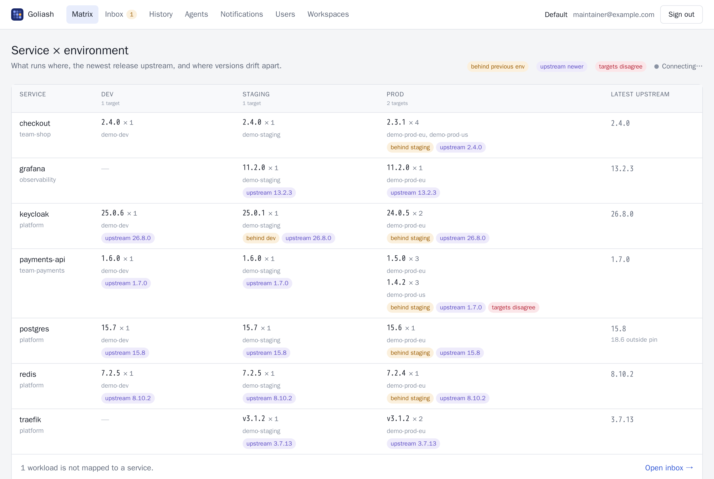

<p align="center">
  <picture>
    <source media="(prefers-color-scheme: dark)" srcset="docs/assets/wordmark-dark.svg">
    
  </picture>
</p>

<p align="center">
  <strong>What runs where, on which version, in which environment — across Kubernetes, ECS, Lambda, Nomad, Docker Swarm, plain Docker and Linux servers.</strong>
</p>

<p align="center">
  <a href="https://github.com/pipozzz/goliash/actions/workflows/ci.yml"></a>
  <a href="LICENSING.md"></a>
  <a href="LICENSING.md"></a>
  
</p>

Goliash watches what actually runs, builds a **service × environment matrix** with the running and the newest
upstream version, and tells you when a new release ships or when environments drift apart — staging on 1.5.0 while
prod is still on 1.3.2, or two prod clusters disagreeing.

<p align="center">
  
</p>

**Documentation: [goliash.dev](https://goliash.dev/)**

> **Status:** stable. From 1.0 the REST API, the agent protocol, MCP tools, CLI, configuration and metrics keep
> working within 1.x; see [Versions and compatibility](https://goliash.dev/reference/compatibility/). Security
> reports: [SECURITY.md](SECURITY.md).

## Try it

```sh
docker run --rm -p 8080:8080 ghcr.io/pipozzz/goliash try
```

A throwaway server with three weeks of example data: open the link it prints and you are signed in. Nothing is
kept when you stop it. Or look around the **[live demo](https://demo.goliash.dev)** first, no install. To run it
for real, see [Getting started](https://goliash.dev/getting-started/).

## Features

- **One matrix for every orchestrator.** Kubernetes (watch), Amazon ECS, AWS Lambda (per alias), Nomad, Docker Swarm
  and plain Docker/Compose hosts, side by side, per environment — with replicas, targets and rollouts in progress,
  grouped by application, team or status.
- **Connected in two clicks.** Pick the platform, copy one command: the agent registers itself with an enrollment
  code and finds what to watch — the cluster, the Docker host, every ECS cluster and Lambda function of the region.
  One code for a whole fleet works too.
- **Applications, not just containers.** Workloads grouped by application from Kubernetes, Helm and Compose labels or
  Nomad jobs; Dokploy and Nomploy projects come together under one name. A database image shared by several apps is
  compared within each app.
- **Upstream awareness.** Tags from Docker Hub, GHCR, Quay, registry.k8s.io, ECR, Google Artifact Registry, Azure ACR
  and private registries (credentials from the agent's environment, `docker login`, pull secrets or the pod's cloud
  identity), compared with per-service semver policies (track minor only, pin a major, ignore `-alpine` noise).
  Moving tags resolved by digest (`1 = 1.27.3`). A built-in catalog of popular images, release dates and
  release-notes links from GitHub.
- **Tiles.** The matrix drawn like the logo: every application a cell, coloured by how current it is, warm where
  something needs attention; open a cell for its services, compare environments side by side, or put it on a wall
  screen. The browser tab's icon shows the workspace's state too.
- **Know what to upgrade first.** The Updates page lists every upgrade with its target version, end of life first,
  production first; put items off, copy it as a checklist, or get it weekly as an upgrade plan per team.
- **Drift that matters.** An environment behind the one before it, a version behind upstream, targets that
  disagree — shown at once, announced only when it lasts.
- **History without CI.** Every deploy, rollout, retag and removal, read from the runtime itself.
- **Notifications with less noise.** Slack, Microsoft Teams, Google Chat, Discord, Telegram, ntfy, webhooks (signed), e-mail, browser push and Grafana annotations, instant or as daily/weekly digests, with
  dedup and ack/snooze, and a scheduled upgrade plan.
- **Software outside containers too.** Add a database on a VM or a managed service by hand, with where it runs and
  its version: it counts in the matrix, updates, end of life and the security posture. Or only watch a tool's
  releases.
- **Security posture for whoever answers for the risk.** How long production has run behind an available release
  (median, 90th percentile, 30+ and 90+ days), what is past its end of life, accepted risk, supply-chain findings and
  blind spots, with a CSV and a PDF for risk registers and audits (NIS2, DORA, SOC 2, ISO 27001).
- **On the dashboards you already have.** Ready-made Grafana and SigNoz dashboards (versions, drift, delivery speed,
  image hygiene, Goliash's own health), deploy markers on your graphs, Prometheus alert rules, and a ServiceMonitor,
  PrometheusRule and dashboard from the Helm chart. Settings → Integrations fills in the scrape settings and creates
  the token in one click.
- **Ask your AI assistant.** A built-in MCP server: "what runs in prod?", "what should we upgrade first?", "what
  changed in the last two hours?", answered from live data.
- **Built for teams and MSPs.** Workspaces per client, roles, passkeys, two-factor, magic-link and OIDC sign-in, audit
  log, REST API and Prometheus metrics.
- **Read-only and easy to run.** Collectors only ever read; the agent sends data out over HTTPS, credentials stay
  in your network. One binary each, SQLite or PostgreSQL (several servers for high availability), Helm, Compose,
  Swarm, Nomad, CloudFormation and Terraform manifests included.

Out of scope: deploying or upgrading services (that is CI's or Renovate's job), CVE scanning, library versions in code.

## How it works

```
 your network                                   Goliash server
┌────────────────────────────────┐             ┌──────────────────────────────────┐
│ Kubernetes / ECS / Nomad /     │             │ ingest → mapping → versions      │
│ Swarm  ──read-only──► agent ───┼──HTTPS────► │   │                  │           │
│ private registries ──► agent   │  snapshots  │   ▼                  ▼           │
└────────────────────────────────┘             │ events, matrix   notifier ──► Slack, webhook, e-mail
                                               │ UI, REST API     SQLite / Postgres│
                                               └──────────────────────────────────┘
```

- **goliash-agent** reads orchestrators and private registries and sends full snapshots, heartbeats and registry
  results. Snapshots, not events: an agent outage loses nothing.
- **goliash** (server) turns snapshots into events, maps containers to services and environments, compares them
  with upstream releases and sends notifications. It can also collect targets itself, without an agent.

## Quickstart

```sh
curl -fsSLO https://raw.githubusercontent.com/pipozzz/goliash/main/docker-compose.yml
docker compose up -d
docker compose logs goliash | grep link=        # open it to create your account
docker compose exec goliash goliash demo        # optional: three weeks of example data
```

Open the setup link, create your account, then **Connect**: pick Kubernetes, Docker, Swarm, Nomad, ECS or Compose
files, fill in one form, and run the command it shows where the agent can reach your orchestrator. The page follows
the agent connecting and its first report.

To watch the Docker host the quickstart runs on, no agent is needed:

```sh
docker compose --profile watch-host up -d                           # adds a read-only docker-socket-proxy
docker compose exec goliash goliash env create -name prod -position 30
docker compose exec goliash goliash target create -env prod -platform docker -name this-host \
  -settings '{"docker":{"docker_host":"tcp://socket-proxy:2375"}}'
```

Ready-made manifests for Kubernetes (Helm), Nomad, Docker Swarm, plain Docker hosts and ECS are in
[`deploy/`](deploy). The Helm charts are also published as `oci://ghcr.io/pipozzz/charts/goliash` and
`oci://ghcr.io/pipozzz/charts/goliash-agent`.

**Without an agent:** a target created without an agent (`goliash target create` without `-agent`, or "the server
itself" in the UI) is collected by the server, with the same read-only collectors. That suits a self-hosted server
next to what it watches, e.g. the Kubernetes cluster it runs in (`helm … --set collectInCluster=true`) or a Swarm or
Docker host through a socket proxy. Turn it off with `-collect=false`.

## Install

- **Images:** `ghcr.io/pipozzz/goliash` and `ghcr.io/pipozzz/goliash-agent` (linux/amd64, linux/arm64; distroless,
  non-root). Images and release archives are signed with cosign (keyless) and come with SPDX SBOMs.
- **Binaries:** archives for Linux, macOS and Windows on the GitHub releases page.
- **From source:** `make build`, or `docker build --target server .` / `--target agent`.

Notification channel secrets (Slack and webhook URLs, signing secrets) are encrypted at rest with AES-256-GCM. The
key comes from `GOLIASH_SECRET_KEY` or `GOLIASH_SECRET_KEY_FILE` (32 bytes, base64 or hex: `openssl rand -base64 32`);
with SQLite and neither set, the server creates `goliash.key` next to the database. Back the key up with the
database: without it, channels must be created again. With PostgreSQL, set the key explicitly.

The server keeps its SQLite database in `/data` (set `GOLIASH_DATABASE_URL=postgres://…` for PostgreSQL) and
deletes processed snapshots beyond the newest 20 per target every hour (`-keep-snapshots`); history lives in events.
Releases are published by pushing a `v*` tag.

## Usage

### Web UI

Open `GOLIASH_PUBLIC_URL` (default `http://localhost:8080`) and sign in with a link from
`goliash login-link -email you@example.com`. The UI is server-rendered (templ + htmx), works without a build step
and updates live over server-sent events.

| Page | What it is for |
| --- | --- |
| Matrix | service × environment with versions, replicas, targets, drift badges and the latest upstream; filter (`/`) and "only with drift"; time travel to a past moment; CSV export; cards on phones; a first-run checklist when empty |
| Service | where it runs, upstream releases, history, version policy, acknowledgements, "check upstream now"; delete once it runs nowhere |
| Inbox | unmapped workloads with a suggested name; mapping creates a rule for that image; the list of mapping rules |
| Hygiene | moving tags, tags pushed again, untrusted registries and images without a digest, summarised by kind |
| Delivery | versions waiting for the next environment with the releases they bring; deploys and lead times per environment; a printable monthly report per workspace |
| History | every event, filterable by service, environment and type |
| Settings → Agents and targets | agents and targets with collector health; environments (rename, reorder); edit targets; add agents with install commands, rotate or revoke tokens, rename and delete agents, move or delete targets |
| Settings → Notifications | channels (test, edit, delete) and rules (pause, delete) |
| Settings → Users and API tokens | invite people, change roles, sign-in links, sign out, remove passwords, API tokens with roles and expiry, the audit log (admins) |
| Settings → Workspaces | one workspace per team or client (organization admins) |
| Account (your avatar) | name, password, and every browser you are signed in on |

### Sign-in, API and metrics

```sh
bin/goliash login-link -email you@example.com      # first user becomes owner; prints a one-time link
bin/goliash user create -email dev@example.com -role member
bin/goliash user password -email you@example.com    # optional: sign in with a password too
bin/goliash token create -name prometheus           # glsh_api_… for /api/v1, /metrics and /mcp (viewer)
```

- **Passwords** (argon2id, at least 12 characters): everyone sets one on their account page, or an admin runs
  `goliash user password`. Repeated failures pause sign-in for an address for 15 minutes. Turn passwords off with
  `GOLIASH_PASSWORD_LOGIN=false` when everyone uses OIDC. The account page also lists where you are signed in.
- **Two-factor sign-in** (TOTP from any authenticator app, recovery codes) on the account page; it also guards
  sign-in links. Admins reset it for someone who lost their phone.
- **Magic links** are e-mailed when SMTP is configured (`GOLIASH_SMTP_*`); `goliash login-link` works without it.
- **OIDC**: `GOLIASH_OIDC_ISSUER`, `GOLIASH_OIDC_CLIENT_ID`, `GOLIASH_OIDC_CLIENT_SECRET`, optional `GOLIASH_OIDC_NAME`
  and `GOLIASH_OIDC_DOMAINS` (people from these e-mail domains are created as viewers on first sign-in; others
  need an account). Redirect URI: `<public URL>/auth/oidc/callback`.
- Set `GOLIASH_PUBLIC_URL` to the address people use; with `https://` cookies are marked Secure.
- **Roles**: viewer reads; member maps services, edits policies and acks; admin manages agents, targets, channels,
  tokens and users; owner can do everything. Viewer, member and admin are per workspace; admin and owner of the
  organization reach every workspace. Organization admins change roles under Settings → Users and API tokens; only owners grant or
  take the owner role, and the last owner cannot be removed.
- **REST API** (session or `Authorization: Bearer glsh_api_…`): `GET /api/v1/matrix`, `/services`, `/environments`,
  `/targets`, `/events?service=&environment=&type=&before=&limit=`, `/drifts`; `POST /api/v1/acks`. The OpenAPI
  description is [`api/public-v1.yaml`](api/public-v1.yaml), also served at `/api/v1/openapi.yaml`; every response
  is tested against it.
- **AI assistants (MCP)**: every server serves the Model Context Protocol at `/mcp` (Streamable HTTP, API token),
  and `goliash mcp` runs it on stdio for Claude Desktop or Cursor. Tools: matrix, service, drifts, updates, changes,
  promotions, delivery, inventory, hygiene, vulnerabilities and acknowledge.
- **Prometheus** `GET /metrics` (same auth): what runs where (`goliash_deployed_version_info`), drift
  (`goliash_outdated`, `goliash_drift_days`), delivery (`goliash_deploys`, `goliash_lead_time_seconds`), image
  hygiene and the server's own health. Dashboards for [Grafana](deploy/grafana/goliash-dashboard.json) and
  [SigNoz](deploy/signoz), [alert rules](deploy/prometheus/goliash-alerts.yaml), and the Helm chart's `metrics.*`
  options are described in [Grafana and SigNoz](https://goliash.dev/guide/observability/).

### Versions, upstream and drift

```sh
bin/goliash matrix                 # service × environment, latest upstream, drift markers
bin/goliash matrix -at 2026-09-12T14:00   # what ran then (history is kept for 400 days)
bin/goliash inventory -csv         # every running container with image and digest, for audits
bin/goliash hygiene                # moving tags, retagged images, untrusted registries (GOLIASH_ALLOWED_REGISTRIES)
bin/goliash drift                  # open drifts
bin/goliash promotions             # versions waiting for the next environment, with the releases they bring
bin/goliash delivery               # deploys per environment and lead times between environments, last 30 days
bin/goliash events                 # history: deployed, version_changed, removed, new_release, drift_*
bin/goliash events -env prod -since 2h   # what changed before an incident
bin/goliash check                  # check upstream registries now (the server does it hourly)
bin/goliash service set -name postgres -track minor -pin-major 15
bin/goliash rule create -match image_repo -pattern 'ghcr\.io/acme/pay.*' -service payments
```

- **Mapping:** labels `goliash.service` / `app.kubernetes.io/name` (and `goliash.env`), then rules, then unmapped
  workloads wait in the inbox with a suggested name.
- **Upstream:** public registries (Docker Hub, GHCR, Quay, registry.k8s.io, …) are checked by the server; other
  registries by the agent, with credentials from `GOLIASH_CREDENTIAL_<REGISTRY_HOST>` (`user:password` or a
  token). Private Amazon ECR repositories go through the ECR API with the agent's AWS credentials (IAM
  `ecr:ListImages`; IRSA, task role or instance profile), where the credential, if set, names an AWS profile.
  New services are checked within a minute, then hourly.
- **Policy per service:** `tag_filter`, `track` (patch/minor/major), `pin_major`, `prerelease`. Without a filter,
  tags are compared like with like (same `-alpine` variant, same number of version parts).
- **Catalog:** [`catalog/images.yaml`](catalog/images.yaml) holds default policies for popular public images
  (postgres, redis, nginx, keycloak, traefik, grafana, prometheus, …) and where their release notes live. A service
  without its own policy uses the catalog's; additions are welcome as pull requests.
- **Release notes:** releases get their publication date and a release notes link from GitHub or GitLab releases
  (the catalog's `github`/`gitlab`, `"github": "owner/repo"` or `"gitlab": "gitlab.com/group/project"` in a
  service's own policy, or the image's own `org.opencontainers.image.source` label) or a changelog URL template.
  GitLab means gitlab.com and one self-hosted instance in `GOLIASH_GITLAB_URL` (token: `GOLIASH_GITLAB_TOKEN`). The label is read from the registry once a
  week, so most images built with GitHub Actions get release notes without any setup. Links appear in the UI and in
  new-release notifications. Set `GOLIASH_GITHUB_TOKEN` to raise GitHub's rate limit.
- **Drift:** `env` (an environment runs an older version than the one before it), `upstream` (behind the newest
  release by at least the tracked jump), `inconsistent` (targets of one environment disagree), `declared` (what runs
  differs from what Compose files in Git declare, when an environment has both), `eol` (the running release cycle
  reaches its end of life within 60 days, from [endoflife.date](https://endoflife.date); `"eol": "none"` turns it
  off, `-eol=false` for servers without internet access). Drift shows in the UI
  at once but is announced (`drift_detected`) only after it lasts: `env` 7 days, `upstream` immediately,
  `inconsistent` 15 minutes, `declared` 30 minutes. Override per service, e.g. `"drift_alert_after": {"env": "72h"}`.
- **Stale data:** a target whose agent stopped sending heartbeats, or without a snapshot for three poll intervals
  (at least 15 minutes), is marked "stale data" in the matrix.
- **Audit log:** every change to configuration, tokens and roles (UI, API, CLI) and every sign-in is recorded and
  shown to admins under Settings → Users and API tokens.

### Workspaces (MSPs, teams)

Each workspace has its own agents, targets, services, history, notifications and API tokens.

```sh
bin/goliash workspace create -name "Client A" -slug client-a -envs
bin/goliash user create -email ops@client-a.example -role member -workspace client-a
bin/goliash user grant -email ops@client-a.example -role admin -workspace client-a
bin/goliash matrix -workspace client-a        # every command takes -workspace (or GOLIASH_WORKSPACE)
```

Organization owners and admins reach every workspace and switch between them in the top bar. Everyone else only
sees the workspaces they were invited to, as viewer, member or workspace admin; a workspace admin manages the
people of that workspace only. Clients of an MSP therefore never see each other.

### Notifications

```sh
bin/goliash channel create -type slack -name ops -url https://hooks.slack.com/services/…
bin/goliash channel create -type webhook -name ci -url https://example.com/goliash -secret s3cret
bin/goliash channel create -type discord -name releases -url https://discord.com/api/webhooks/…
bin/goliash channel create -type telegram -name team -token 123456:ABC… -chat-id -1001234567890
bin/goliash channel create -type ntfy -name phone -url https://ntfy.sh/my-goliash
bin/goliash channel create -type email -name oncall -to oncall@example.com   # GOLIASH_SMTP_* or -smtp-addr/-smtp-from
bin/goliash channel test -name ops
bin/goliash notify create -channel ops -events new_release,drift_detected,agent_stale -mode daily -min-jump minor
bin/goliash ack -service postgres -kind release -until-version 17.0     # "we know about 16, quiet until 17"
bin/goliash ack -service web -kind drift -for 336h                       # quiet for 14 days
```

Rules match event types and optionally services, owners, environments and the size of a release jump. `instant`
rules deliver within seconds (items arriving together are batched); `daily` and `weekly` rules collect a digest
sent at `digest_hour` (UTC). A release is announced once per service and version. Failed deliveries are retried
with backoff. Webhook bodies are signed: `X-Goliash-Signature: sha256=HMAC(secret, X-Goliash-Timestamp + "." + body)`.

### Collectors and credentials

| Platform | Reads | Needs | Credentials |
| --- | --- | --- | --- |
| Kubernetes | Deployments, StatefulSets, DaemonSets, CronJobs and their running pods (watch) | ClusterRole with `get`, `list`, `watch` | in-cluster service account, else kubeconfig (`kubeconfig_context` optional) |
| ECS | clusters → services → running tasks → task definitions | IAM `ecs:List*`, `ecs:Describe*` | default AWS chain; `credentials_ref` = AWS profile name |
| Nomad | jobs, job versions, allocations | ACL token with `list-jobs` and `read-job` | `credentials_ref` → token, else `NOMAD_TOKEN` |
| Docker Swarm | services and running tasks | Docker API `GET` only (docker-socket-proxy) | none |
| Docker | running containers, grouped into Compose services (optionally only some `projects`); registry digests | Docker API `GET` on containers and images (docker-socket-proxy) | none |
| Compose files | services and images declared in Compose files, without a Docker engine | an HTTP(S) URL, or for an agent a file in `GOLIASH_COMPOSE_DIRS` | `credentials_ref` → bearer token for the URL |

The server only sends a `credentials_ref` name. The agent resolves it from the environment variable
`GOLIASH_CREDENTIAL_<NAME>` (upper-cased, non-alphanumerics as `_`) or the file
`$GOLIASH_CREDENTIALS_DIR/<name>` (default `/etc/goliash-agent/credentials`).

The agent registers, follows its configuration (polled every minute with an ETag), sends a heartbeat every minute
and buffers snapshots in `-data-dir` while the server is unreachable (the oldest are dropped beyond 200).
The protocol is in [`api/agent-v1.yaml`](api/agent-v1.yaml); the server validates every request against it.

## Development

### Repository layout

| Path | What | License |
| --- | --- | --- |
| `cmd/goliash` | Server binary | AGPL-3.0-only |
| `cmd/goliash-agent` | Agent binary | Apache-2.0 |
| `internal/agent` | Agent loop | Apache-2.0 |
| `internal/collectors/{kubernetes,ecs,nomad,swarm,docker,compose}` | Read-only collectors | Apache-2.0 |
| `internal/registry` | OCI Distribution API client | Apache-2.0 |
| `api/agent-v1.yaml` | Agent protocol (OpenAPI 3.0) | Apache-2.0 |
| `pkg/agentproto` | Protocol types and client, generated from the spec | Apache-2.0 |
| `pkg/buildinfo` | Build metadata | Apache-2.0 |
| `internal/{api,ingest,mapping,versions,notifier,store,ui}` | Server | AGPL-3.0-only |
| `internal/store/migrations/{sqlite,postgres}` | Database migrations (goose), embedded in the server | AGPL-3.0-only |
| `deploy/{helm,nomad,swarm,docker,ecs}` | Deployment manifests | AGPL-3.0-only |

### Building

Requires Go (version in `go.mod`) and, for linting, [golangci-lint](https://golangci-lint.run) v2.

```sh
make build          # bin/goliash and bin/goliash-agent
make generate       # regenerate pkg/agentproto after editing api/agent-v1.yaml
make test           # SQLite; set GOLIASH_TEST_POSTGRES_DSN to also run against PostgreSQL
make lint           # license boundary check + golangci-lint
scripts/lab/up.sh   # k3s, Swarm and Nomad in Docker with a server and agent; prints a sign-in link
```

The documentation site lives in [`website/`](website) (Astro Starlight): `cd website && npm install && npm run dev`.

## License

The agent and the code it is built from are licensed under [Apache-2.0](LICENSES/Apache-2.0.txt); the server is
licensed under [AGPL-3.0-only](LICENSE). Each source file states its license in an SPDX header.
See [LICENSING.md](LICENSING.md) for details.

## Contributing

Contributions are welcome. Please read [CONTRIBUTING.md](CONTRIBUTING.md); external contributions require signing
the [CLA](CLA.md).
