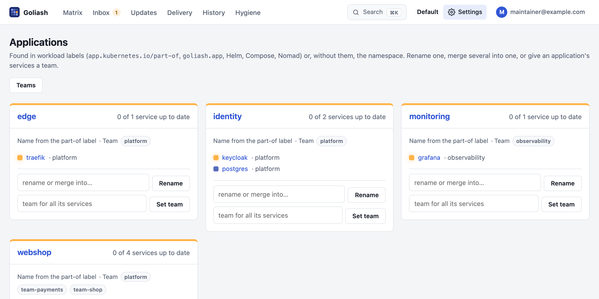

Goliash groups services two ways: by **application** (what a service is part of: a webshop, an identity stack) and by
**team** (who owns it). The matrix, tiles, updates, upgrade plans and notification rules all use both.



## Where applications come from

Each workload's application is read from its labels, first match wins:

1. the label set for the workspace on the Users page (*Application label*, e.g. `example.com/app`);
2. `goliash.app`, `app.kubernetes.io/part-of`, `app.kubernetes.io/instance` or `release` (Helm),
   `com.docker.compose.project`, `com.docker.stack.namespace`;
3. the Nomad job;
4. otherwise the namespace.

A service runs in the application of its workloads. When it runs in several (one postgres image, a database for each
application), it shows once per application and drifts within each.

When nothing tells such workloads apart (no labels, one namespace or none), but they have different names
(`goliash-db` and `cefiro-db`, both `postgres`), each workload name counts as its application, so every database is
compared on its own instead of showing up as one inconsistent service. Replicas of one workload (the same name on two
clusters) stay together, and the random suffix platforms such as Nomad, Dokploy or Nomploy add on each deploy is
ignored.

### Shared images in the Inbox

A workload running a shared image such as `postgres` or `redis` can be mapped two ways in the **Inbox**:

- **Map**: every workload running the image goes to one service (`postgres`), split per application as above.
- **Map only this workload**: this workload becomes a service of its own (`goliash-db`), by its name without the
  generated suffix, so it keeps mapping after a redeploy renames it. Other workloads running the image stay apart.

Rules made from the Inbox match exactly: a rule for `postgres` no longer catches `postgres-exporter`.

Names generated by platforms like Dokploy or Nomploy (`cefiro`, `cefiro-db`, `cefiro-redis`) are shown under their
shared first word; names from a label someone chose are never merged.

### Applications made of parts

Dokploy and Nomploy deploy each service of a project as its own Compose project or job (`velin-lawrio`,
`velin-portal`, `velin-mattermost`). Goliash shows them as one application, *velin*, and opening it on the tiles
board shows its **parts** first, like the project page in Dokploy: *lawrio*, *portal*, *mattermost*, each coloured by
its services. Opening a part shows its services; the title (*velin › lawrio*) and × lead back one level at a time.

## Renaming and merging services

A service is named when it is first mapped, often after the workload: the first `redis` mapped in the Inbox may be
called `cefiro-redis`, and every project's redis then shows under that name. On the service page, **Rename** it after
the image (`redis`). To join two services (two names for one image), rename one to the other's name and tick
**merge into it**: its workloads, history, mapping rules, acknowledgements and releases move over, and it is deleted.
Notification rules that name a service by its old name need the new one.

```sh
goliash service rename -name cefiro-redis -to redis
goliash service rename -name lawrio-redis -to redis -merge
```

## Managing applications

**Settings → Applications** lists every application with where its name comes from, its team and its services.
Members and up can:

- **Rename** an application: type a new name. Every workload with the old name is shown under the new one: the matrix, tiles,
  updates, delivery and drift.
- **Merge** applications: rename one to the name of another. The card then says *From* with the names it was made of.
- **Split out** a name again: *split out* next to it on the card.
- **Set team**: give every service of the application one team. The application keeps it as its team: services
  that appear in it later, without an owner, get it too (within a minute). *forget* next to *Team for new services*
  stops that; services keep the team they have. A service in several applications with different teams gets none,
  and an owner set by hand is never replaced.

To put a single service in an application whatever its labels say, set **Application** on the service's page (or
`goliash service set -name postgres -app identity`). Empty goes back to the labels.

Open drift follows these changes: it moves to the new name and keeps when it opened and whether it was announced, so
nothing is announced again.

```sh
goliash app rename -from shop-frontend -to webshop    # rename; an existing name merges
goliash app rename -from shop-frontend                # its own name again
```

## Teams

A service's team is its **owner**. Goliash takes it from, in this order:

1. **set by people**: on the service page, `goliash service set -owner`, or **Settings → Teams** (assign or
   rename). It is never overridden;
2. **the workloads' labels**: `goliash.team`, `team`, `owner` or `app.kubernetes.io/team` (first found). It follows
   label changes within a minute;
3. **the application's team** (*Set team* on the Applications page), for services in it without either.

A service whose workloads name different teams, or whose applications have different teams, is left for people.
The service page says where its owner came from; changing it there takes over from labels for good.

**Settings → Teams** lists every team with its applications and services, renames a team on all its services, and
lists services **without a team** to give them one in a few clicks.

```sh
goliash team rename -from team-shop -to commerce
```

Renaming a team does not change notification rules that filter by the old name: update their *Owners* filter too.

## Label conventions

Put the application and the team on the workloads where they are deployed; Goliash then needs no setup per service,
and new services arrive with both.

| What | Label | Example |
| --- | --- | --- |
| Application | `app.kubernetes.io/part-of` (Kubernetes standard) or `goliash.app` | `webshop` |
| Team | `goliash.team` (or `team`, `owner`, `app.kubernetes.io/team`) | `team-shop` |
| Service | `app.kubernetes.io/name`, else the workload name | `checkout` |

Kubernetes (Deployment, StatefulSet, … labels):

```yaml
metadata:
  labels:
    app.kubernetes.io/name: checkout
    app.kubernetes.io/part-of: webshop
    goliash.team: team-shop
```

Docker Compose and Swarm (service labels; Compose names the application after the project by itself):

```yaml
services:
  checkout:
    image: ghcr.io/acme/checkout:2.4.0
    labels:
      goliash.app: webshop
      goliash.team: team-shop
```

Nomad (job `meta`):

```hcl
job "checkout" {
  meta {
    "goliash.app"  = "webshop"
    "goliash.team" = "team-shop"
  }
}
```

ECS: the same keys as **tags on the ECS service** (`goliash.app`, `goliash.team`). A different label key for
applications (say `example.com/product`) can be set per workspace on the Users page.

## Recommended setup

1. **Label at the source.** Add `app.kubernetes.io/part-of` (or `goliash.app`) and `goliash.team` to your Helm
   charts, manifests, Compose files or Nomad jobs. One line per workload, right everywhere and for new services.
2. **Tidy the applications.** On **Settings → Applications**, rename generated names (namespaces, Dokploy
   projects) and merge duplicates; place odd services by hand on their page.
3. **Give every application a team.** *Set team* on each card covers what has no label yet, now and later.
   Shared infrastructure (databases, ingress, monitoring) usually belongs to `platform`.
4. **Empty "Without a team".** Check **Settings → Teams** until no service is left without one.
5. **One name per team.** Lowercase, the same as in Slack or GitHub (`team-shop`, not also `Shop`). Renaming later
   works, but rules filtering by the old name need updating.
6. **Route notifications per team.** A channel per team and rules filtered by *Owners*: releases and drift right
   away (with quiet hours), the upgrade plan weekly on Monday at 09:00 in the team's time zone; end of life and
   stale agents to platform or on-call.
7. **One workspace for one company.** Teams share it and filter their view. Use separate workspaces only for
   tenants that must not see each other (clients, separate organizations).
8. **Use it as the backlog.** Each team works from **Updates** filtered by its team (copied as a checklist into
   tickets) and the tiles grouped by team; a TV on the wall can cycle them (`/tiles?group=team&tv=1&cycle=60`).

## Notifications per application or team

A notification rule can be limited to applications (*Applications* in the rule form, `-apps` with
`goliash notify create`) or teams (*Owners*, `-owners`): one channel per team or product, each getting only its own
releases, drift and upgrade plan.
