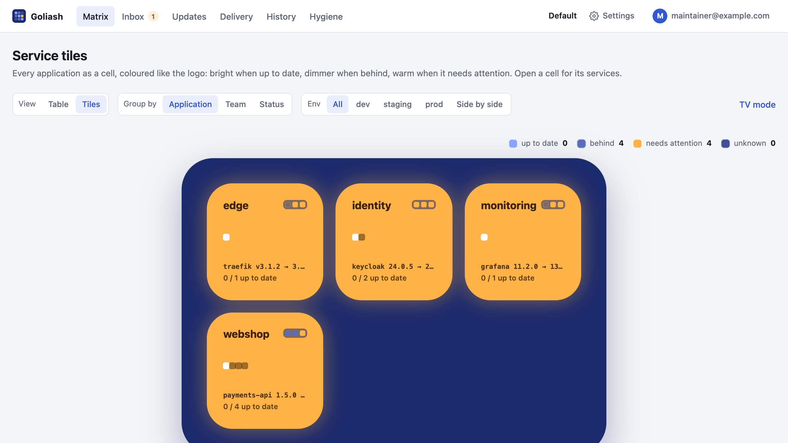
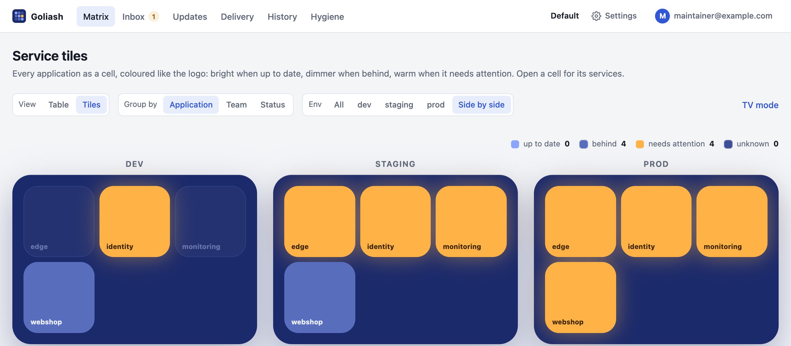
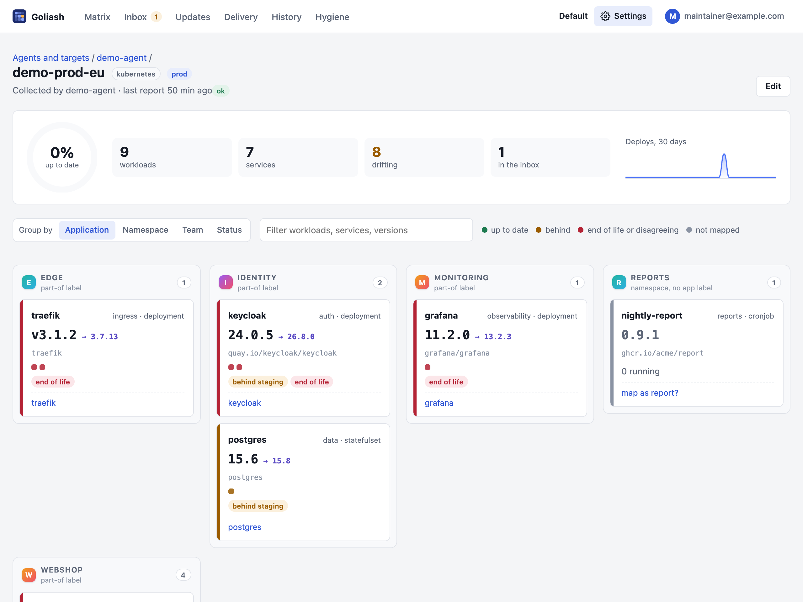

## The matrix

The matrix has one row per **service** and one column per **environment**, in promotion order (dev, staging,
prod). Each cell shows the versions running there, with replicas and the targets they run on. The last column shows
the newest upstream version the service's policy accepts.

**Filter** the matrix by typing above it (press <kbd>/</kbd> to jump there): every word must appear in the service,
its owner, a version, a target or a badge, so `team-payments end` finds that team's services on an end-of-life
release. **Only with drift** hides the rest. The filter is part of the address, so a filtered matrix can be
bookmarked or shared. **Time travel** shows the matrix as of a past moment; **Export CSV** downloads the inventory.


On a phone the matrix turns into one card per service, with each environment as a row inside it, so nothing scrolls
sideways. The same filter and drift switch work there.

Badges in a cell:

| Badge | Meaning |
| --- | --- |
| behind *env* | This environment runs an older version than the one before it. |
| upstream *x.y.z* | A newer release exists, at least as large a jump as the policy tracks. |
| targets disagree | Targets of this environment run different versions. |
| stale data | The agent stopped sending heartbeats, or there has been no snapshot for three poll intervals (at least 15 minutes). |

During a rollout, both versions show with their replica counts. The matrix updates live as snapshots arrive.

**Group by** above the matrix puts services under headings: **Application** (default), **Team** (the service's
owner) or **Status** (needs attention, behind, up to date), or **None** for one list. A service's application is the
one most of its workloads belong to (see below how it is found). Each heading shows how many of its services are up
to date, as a bar, and the filter hides headings with nothing left under them. The choice stays in the link, also
while looking back with time travel.

### One image, several applications

A service such as `postgres` or `redis` often serves several applications, each with its own database on its own
version. When two applications run a service in one environment, Goliash compares its versions **within each
application**: the matrix shows one line per application (*postgres in auth*, *postgres in chat*), and drift
(behind the previous environment, targets disagreeing, behind upstream, end of life) is worked out per line. Postgres
16 in one application and 18 in another is not drift; an application whose production is behind its own staging
still is. Upstream releases and the version policy stay one per service, and notifications name the application.

This depends on knowing the application (see below): Compose projects, Helm releases and `app.kubernetes.io/part-of`
work out of the box, and a Nomad job counts as an application of its own.

## Tiles

**View → Tiles** draws the matrix the way the logo does: a navy board of rounded cells, one per application (or team,
or status), coloured like the logo's cells. Bright means up to date, dimmer means behind, faint means there is nothing
to compare with, and warm means it needs attention: end of life, or targets disagreeing.



- **Each cell** shows its services as dots, its most urgent upgrade, how many services are up to date, and a strip with
  one square per environment in its state there. Applications with four services or more take a double cell once a
  board has six or more.
- **Open a cell** for the same board for that application, one cell per service. *All applications* at the top leads
  back. Open a service for its versions per environment, the newest release with its notes, its drift and a link to
  its page; Escape closes it.
- **Env** colours the board for one environment. **Side by side** draws one board per environment with every
  application in the same place, so you can see at a glance where prod lags behind staging.



- The board follows changes live, and a cell whose state changed pulses. **TV mode** hides the header and fills the
  screen, for a wall display.
- The browser tab's icon is the logo coloured by the workspace: as many of its nine cells as needed turn warm or dim,
  so a pinned tab tells you when something needs attention.
- The view you used last is remembered: `/` opens the tiles until you choose **Table** again.

## One target at a glance

Click a target's name under **Settings → Agents and targets** to see what runs on that cluster or host: a ring
with the share of workloads that are up to date, counts of services, drift and workloads waiting in the inbox,
deploys per day over thirty days, and every workload as a card, one column per application. A card shows
the version (and a newer acceptable one), the image, a dot per running replica, drift badges and its service;
its colour says how current it is (green up to date, amber behind, red end of life or targets disagreeing, grey not
mapped), and problems come first. The filter above the cards matches names, services, versions and badges. Below,
**What changed here** lists the latest deploys on this target.



**Group by** arranges the columns, and the choice stays in the link:

| Group by | Columns |
|---|---|
| Application (default) | What the workload belongs to, from its labels (below). |
| Namespace | The Kubernetes or Nomad namespace, the Compose project or the Swarm stack. |
| Team | The owner of the workload's service; unmapped workloads and services without an owner go under *no owner*. |
| Status | Needs attention, behind, not mapped, up to date. |

A workload's application is the first of these labels it has: the workspace's own label key (set under
**Settings → Users → Applications**, for example `example.com/app`), `goliash.app`, `app.kubernetes.io/part-of`,
`app.kubernetes.io/instance` (the Helm release), `release`, `com.docker.compose.project` and
`com.docker.stack.namespace`. Without any of them, a Nomad job's name stands in, else its namespace.

Platforms such as Dokploy and Nomploy name what they deploy `<project>-<part>-<6 random characters>`. Goliash drops
the random part (`cefiro-db-wruzyw` is `cefiro-db`), and groups the parts of one project under its name: `cefiro`,
`cefiro-db` and `cefiro-redis` appear together as **cefiro**, with the parts listed under the heading. Names from
labels are never changed. The column caption says where the
name came from, so a column captioned *namespace, no app label* is a hint to label those workloads. A new label
key applies from each target's next snapshot.

## Looking back, and exporting for audits

Open **Time travel** above the matrix and pick a date and time to see what ran then: "what was in prod on 12 September at
14:00?". Goliash keeps when each version ran for 400 days, so the answer is right even after versions moved on and
back. Drift and upstream releases describe now, so they are not shown for the past.

**Export CSV** downloads every container that runs (or ran at that time), sidecars included, with environment,
target, workload, image, tag, digest, replicas and when it was first seen: an asset inventory for ISO 27001 or
SOC 2 audits. The same is available from the CLI and the API:

```sh
goliash matrix -at 2026-09-12T14:00
goliash inventory -csv > inventory.csv
goliash inventory -at 2026-09-12T14:00 -csv
curl -H "Authorization: Bearer $GOLIASH_TOKEN" "https://goliash.example.com/api/v1/inventory?format=csv&at=2026-09-12T14:00"
```

## Image hygiene

**Image hygiene** (linked above the matrix, with the number of warnings) lists running images that make "what
runs" hard to know or to trust, sidecars included:

| Finding | Meaning |
| --- | --- |
| moving tag | `latest`, `stable`, `main` or no tag: the version cannot be known, and a restart may pull something else. |
| retagged | The same repository and tag run as different images (digests): the tag was pushed again. |
| untrusted registry | The image comes from outside `GOLIASH_ALLOWED_REGISTRIES` (e.g. `ghcr.io/acme,docker.io/library`). |
| unpinned (info) | No digest is known for the image. |

`goliash hygiene`, `GET /api/v1/hygiene` and `goliash_image_hygiene_findings{kind}` in `/metrics` show the same.
Compose files are left out: they declare tags, not what runs.

## Services, environments and targets

- A **target** is one thing a collector reads: a Kubernetes cluster, an ECS region, a Nomad region, a Swarm or a
  Docker host. Each target belongs to one environment.
- An **environment** has a position that sets the promotion order: lower comes first (dev 10, staging 20, prod 30).
- A **service** is what you deploy, wherever it runs. Running workloads are mapped to services.

A workload can override its environment with the label `goliash.env`, for example when one cluster hosts both
staging and prod namespaces.

A service that runs nowhere any more can be deleted from its page by an admin, with its policy, releases, mapping
rules and acknowledgements; its history stays. Admins rename and reorder environments on the Agents page (drift is re-evaluated with the new order), and delete one
once no target belongs to it. **Edit** on a target changes its environment, settings and poll interval; its
collector picks the change up with the next configuration poll.

## How workloads map to services

Each running workload goes through these steps, and the first match wins:

1. **Ignore rules.** Images or containers you chose to ignore.
2. **Labels.** `goliash.service`, else `app.kubernetes.io/name`. The service is created when it does not exist yet.
3. **Rules.** Lowest priority number first. The inbox creates workload-name rules at priority 50 and image rules at
   100, so a rule for one workload wins over a rule for its image. `goliash rule create` defaults to 100.
4. **The inbox.** Everything else waits there with a suggested name, taken from the image.

The labels are Kubernetes labels, ECS tags, Nomad job meta, or Swarm and Docker labels.

Within a workload, the **main container** carries the version. It is the container named by the `goliash.container`
label, else one named like the workload or service. Known sidecars such as `istio-proxy`, `linkerd-proxy`, `envoy`
or `datadog-agent` are skipped.

## The inbox

The inbox groups unmapped workloads by image.

- **Map all** maps every workload running the image to a service at once and adds an image rule, so new
  workloads with that image map by themselves.
- **Map only this** is for an image that runs as several services, for example one image deployed as `web` and
  `worker`. It maps a single workload and adds a workload-name rule, which takes precedence over image rules.
- **Ignore this image** removes it from the inbox at once and stops tracking it from the next snapshot.

Rules can also be created from the CLI:

```sh
goliash rule create -match image_repo -pattern 'ghcr\.io/acme/pay.*' -service payments
goliash rule create -match workload_name -pattern 'worker' -service jobs -priority 50
goliash rule create -match label -pattern 'team=payments' -service payments
goliash rule create -match ignore -pattern 'docker\.io/library/busybox'
```

Patterns are regular expressions that must match the whole value. The inbox page lists every rule; deleting one
returns the workloads it matched to the inbox with the next snapshot, unless another rule or a label maps them.

## History

Every snapshot is compared with the previous one of the same target. The differences become events:

| Event | When |
| --- | --- |
| `deployed` | A workload appears. |
| `version_changed` | A workload runs a different tag. A changed digest under the same tag is noted as a retag. |
| `removed` | A workload disappears. |
| `new_release` | An upstream release newer than everything known appears. |
| `drift_detected`, `drift_resolved` | Drift is announced, or ends. |
| `agent_stale` | An agent stops sending heartbeats. |

The first snapshot of a target is a baseline and creates no events. When a snapshot is incomplete, for example
because one namespace was forbidden, missing workloads are not treated as removed.
