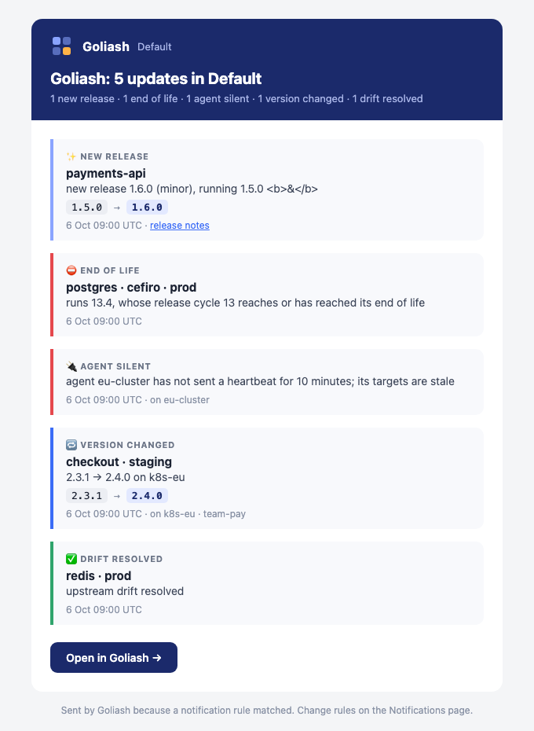

Notifications have two parts: **channels** (where messages go) and **rules** (which events go there, and how
often). Both are managed on the Notifications page or with the CLI.

## Channels

| Type | Settings |
| --- | --- |
| Slack | An incoming webhook URL. |
| Discord | A channel webhook URL (Channel settings → Integrations → Webhooks). |
| Telegram | A bot token from @BotFather and the chat ID the bot posts to. |
| ntfy | A topic URL on ntfy.sh or your own server, e.g. `https://ntfy.sh/my-goliash`, and an optional access token. |
| Grafana | Grafana's URL and a service account token with `annotations:write`; every item becomes an annotation. |
| Webhook | A URL and an optional signing secret. |
| E-mail | Recipients, and optionally the channel's own mail server (see below). |
| Web push | Nothing: each person adds their browsers from the Notifications page (see below). |

```sh
goliash channel create -type slack -name ops -url https://hooks.slack.com/services/…
goliash channel create -type webhook -name ci -url https://example.com/goliash -secret s3cret
goliash channel create -type discord -name releases -url https://discord.com/api/webhooks/…
goliash channel create -type telegram -name team -token 123456:ABC… -chat-id -1001234567890
goliash channel create -type ntfy -name phone -url https://ntfy.sh/my-goliash
goliash channel create -type email -name oncall -to oncall@example.com
goliash channel test -name ops
```

Channel URLs and secrets are encrypted at rest and never shown in full in the UI.

### E-mail

Mail goes through the server's relay (`GOLIASH_SMTP_*`, see [Configuration](/reference/configuration/#e-mail)), or
through the channel's own mail server: open **Own mail server** when adding the channel, or edit it later, and give
the server as `host:port`, the sender address, and a user name and password if it needs them. Encryption is TLS on port
465 and STARTTLS elsewhere unless you pick one; *None* is for a relay on the same host or network. The password is
encrypted with the other channel secrets and never shown again; leave it empty when editing to keep it. **Send test**
checks the whole path. Without a relay on the server, an e-mail channel needs its own.

```sh
GOLIASH_CHANNEL_SMTP_PASSWORD=… goliash channel create -type email -name oncall -to oncall@example.com \
  -smtp-addr smtp.example.com:587 -smtp-from goliash@example.com -smtp-username goliash
```

### Web push

A **Web push** channel sends to browsers: desktop notifications in Chrome, Edge, Firefox and Safari, and on phones.
Add the channel, then press **Notify this browser** next to it in every browser that should get its notifications
(the browser asks for permission once); **Stop on this browser** takes it off again. Anyone with access to the
workspace can add their own browsers; the channel shows how many are on it. Rules pick the events as for any other
channel, so a channel for releases and another for end-of-life drift each go only where they were added.

A notification shows the item's kind, service and change, and opens Goliash on that service when clicked; digests
show the first lines. Browsers that unsubscribed or expired are forgotten at the next message.

- Goliash needs HTTPS (or `localhost`) for browsers to allow push; `GOLIASH_PUBLIC_URL` should be that address.
- On iPhone and iPad (iOS 16.4 or later), add Goliash to the home screen first (Share → Add to Home Screen), then
  open it from there and press **Notify this browser**.
- Messages are encrypted for each browser (RFC 8291) and signed with a key pair the server makes on first use and
  keeps with the other secrets (encrypted at rest with `GOLIASH_SECRET_KEY`). The server sends only to the push
  services of browsers (Google, Mozilla, Apple, Microsoft).

## How messages look

Every item carries its kind, as an emoji and a colour: a new release ✨, drift ⚠️, an end of life ⛔, a resolved
drift ✅, an update ⬆️ coloured by urgency, a silent agent 🔌. With `GOLIASH_PUBLIC_URL` set, messages link back:
each item opens the matrix filtered to its service, and a button opens Goliash (the Updates page for an upgrade plan).

- **Slack** gets Block Kit: a header and a count by kind for digests, one section per item with the versions
  (`1.5.0` → `1.6.0`), a *Release notes* button, and *Open in Goliash* at the end; up to 20 items, then a count.
- **Discord** gets one coloured embed per item (up to ten; longer digests stay a list).
- **E-mail** is HTML with a plain-text alternative, in the logo's colours, readable in any mail client.
- **Web push** shows the kind's emoji and the service as the title, and the change as the text.



## Rules

A rule sends some event types to a channel, optionally only for some services, owners or environments, or only for
releases of at least a given size.

```sh
goliash notify create -channel ops -events new_release,drift_detected,agent_stale -mode daily -min-jump minor
goliash notify create -channel oncall -events drift_detected -envs prod -mode instant
```

| Mode | Delivery |
| --- | --- |
| `instant` | Within seconds. Items arriving together are sent as one message. |
| `daily` | A digest every day at `digest_hour` (UTC, default 8). |
| `weekly` | A digest every Monday at `digest_hour`. |

Admins **edit** a channel (secrets are never shown again; an empty field keeps the stored value). Members **pause** a rule (it queues nothing until resumed) or delete it on the Notifications page; admins delete a
channel together with its rules.

A release is announced once per service and version. Failed deliveries are retried with backoff, from one minute up
to an hour between attempts. Acknowledged releases and drift are not sent; see
[Acknowledging](/guide/versions/#acknowledging).

## Recent deliveries

The bottom of the Notifications page lists the last 25 notifications and how each went: **sent**, waiting **in the
digest** until its hour, **attempt N failed** with the error and when it is tried next (after 1, 2, 4, 8 and 16 minutes),
or **gave up after 6 attempts**. **Retry now** sends a failed one at once and says whether it went through; **Send
now** sends one waiting for its digest. A wrong webhook URL or a revoked Slack hook shows here with what the
service answered.

## Upgrade plan

A rule with the event type `updates_plan` (*upgrade plan* in the form) sends the [Updates](/guide/versions/#updates)
list at its digest time: every day for a daily rule, on Mondays for a weekly (or instant) one. It is one message, most
urgent first: what runs, the version to move to, why, and the release notes. Updates put off with an acknowledgement
are left out, and the rule's services, owners and environments apply, so each team can get its own plan:

```sh
goliash notify create -channel team-payments -events updates_plan -owners team-payments -mode weekly
```

**Send plan now** on the rule sends its plan at once, to check the channel and the filters without waiting for
Monday; the scheduled plans are not affected.

## Deploys on your dashboards

A Grafana channel turns events into annotations, so a deploy shows up on the graphs it may have changed:

```sh
goliash channel create -type grafana -name dashboards -url https://grafana.example.com -token glsa_…
goliash notify create -channel dashboards -events deployed,version_changed,removed -envs prod -mode instant
```

Annotations are tagged `goliash`, the event type, the service and the environment. In a dashboard, add an
annotation query on the built-in Grafana data source, filtered by tags (`goliash`, and for example `prod`).

## What changed before an incident

The History page has a *changed in the last hour / 6 hours / 24 hours / 7 days* filter, and the same works from
the command line and the API:

```sh
goliash events -env prod -since 2h
curl -H "Authorization: Bearer $GOLIASH_TOKEN" "https://goliash.example.com/api/v1/events?environment=prod&since=2h"
```

## Webhook payload

```json
{
  "workspace": "Default",
  "digest": false,
  "link": "https://goliash.example.com",
  "items": [{
    "type": "new_release",
    "service": "payments-api",
    "owner": "team-payments",
    "from": "1.6.0",
    "to": "1.7.0",
    "note": "minor",
    "at": "2026-10-03T08:00:00Z",
    "text": "payments-api: new release 1.7.0 (minor), running 1.6.0",
    "url": "https://github.com/acme/payments-api/releases/tag/v1.7.0"
  }]
}
```

`environment`, `target` and `url` are present when they apply; `link` is the server's public URL. With a secret, the request carries
`X-Goliash-Timestamp` and `X-Goliash-Signature: sha256=<hex>`, where the hex is
`HMAC-SHA256(secret, timestamp + "." + body)`. Check the signature and reject old timestamps:

```python
import hashlib, hmac, time

def verify(secret: bytes, timestamp: str, body: bytes, signature: str) -> bool:
    if abs(time.time() - int(timestamp)) > 300:
        return False
    expected = hmac.new(secret, timestamp.encode() + b"." + body, hashlib.sha256).hexdigest()
    return hmac.compare_digest("sha256=" + expected, signature)
```

## Metrics instead of messages

If you alert from Prometheus, scrape `GET /metrics` with an API token instead:

| Metric | Labels | Value |
| --- | --- | --- |
| `goliash_deployed_version_info` | service, environment, version | running replicas |
| `goliash_outdated` | service, environment | 1 when behind upstream by the tracked jump |
| `goliash_drift_days` | service, environment, kind (and app, for a service compared per application) | days a drift has been open |
| `goliash_deploys` | service, environment | versions that arrived in the last 30 days |
| `goliash_lead_time_seconds` | service, from, to | median time a version took to the next environment, last 30 days |
| `goliash_image_hygiene_findings` | kind | images with a moving tag, a tag pushed again, an untrusted registry or no digest |
| `goliash_build_info` | version | 1 |
| `goliash_leader` | | 1 on the server that runs the background work |
| `goliash_snapshots_pending` | | snapshots received and not processed yet |
| `goliash_notifications_queued`, `goliash_notifications_failing` | | notifications not sent yet, and those that failed at least once |
| `goliash_agents` | status | agents online, stale, never connected or revoked |

Alerts worth having on Goliash itself: `goliash_agents{status="stale"} > 0`, `goliash_snapshots_pending > 20` for
ten minutes, `goliash_notifications_failing > 0`, and `sum(goliash_leader) != 1` across servers.

```yaml
scrape_configs:
  - job_name: goliash
    scheme: https
    authorization: { credentials_file: /etc/prometheus/goliash-token }
    static_configs: [{ targets: ["goliash.example.com"] }]
```

A ready-made Grafana dashboard is in
[`deploy/grafana/goliash-dashboard.json`](https://github.com/pipozzz/goliash/blob/main/deploy/grafana/goliash-dashboard.json):
open **Dashboards → New → Import** in Grafana and upload the file. It shows what runs where, open drift, services
behind upstream per environment, and services running more than one version, filterable by environment and
service.

For SigNoz, scrape `/metrics` with the OpenTelemetry Collector's Prometheus receiver and import
[`deploy/signoz/goliash-dashboard.json`](https://github.com/pipozzz/goliash/blob/main/deploy/signoz/goliash-dashboard.json);
the [README](https://github.com/pipozzz/goliash/blob/main/deploy/signoz/README.md) has the collector configuration.
