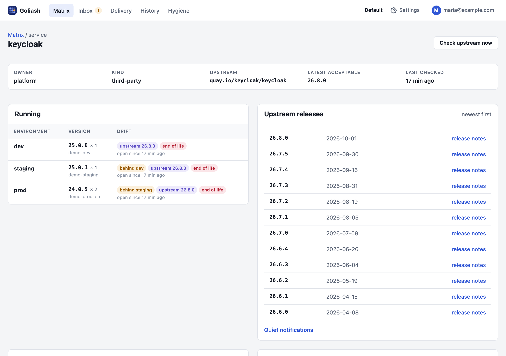
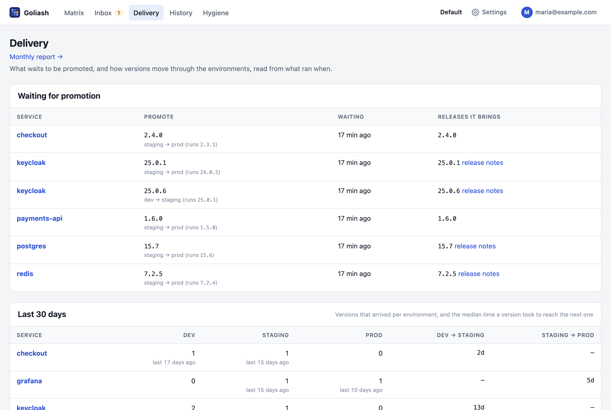

## Where upstream versions come from

For each service, Goliash picks an **upstream repository**: the one set on the service, else the image its main
containers run. It lists that repository's tags and keeps the newest versions the policy accepts as releases.

- **Public registries** are checked by the server: Docker Hub, GHCR, Quay, registry.k8s.io, gcr.io,
  public.ecr.aws, mcr.microsoft.com, registry.gitlab.com and docker.elastic.co.
- **Every other registry** is checked by the agents, with credentials from their own environment. See
  [Collectors](/reference/collectors/#private-registries).

New services are checked within a minute, then every hour. **Check upstream now** on a service page, or
`goliash check`, checks at once.



## Version policy

A policy decides which tags count as versions and which differences are worth an alert. Set it on the service
page, with `goliash service set`, or through the catalog.

| Field | Meaning | Default |
| --- | --- | --- |
| `track` | The smallest jump worth an alert: `patch`, `minor` or `major`. | `patch` |
| `pin_major` | Stay on this major: newer majors are shown, not alerted. | none |
| `tag_filter` | A regular expression tags must match. | tags shaped like the running one |
| `prerelease` | Consider alpha, beta and rc versions. | `false` |
| `drift_alert_after` | How long drift lasts before it is announced, per kind, e.g. `{"env": "72h"}`. | see below |
| `github`, `github_tag_prefix` | GitHub repository (`owner/repo`) whose releases give dates and release notes. | from catalog or image label |
| `gitlab` | GitLab project (`gitlab.com/group/project`) whose releases give dates and release notes; `github_tag_prefix` applies too. | from catalog or image label |
| `changelog` | A release notes URL template with `{version}`. | none |

Without a `tag_filter`, tags are compared **like with like**: a service running `1.27.2-alpine` is compared with
other `-alpine` tags with three version parts, so `latest`, `mainline` or `1.27-bookworm` do not count.

```sh
goliash service set -name postgres -track minor -pin-major 15
goliash service set -name app -tag-filter '^v\d+\.\d+\.\d+$'
```

## The catalog

The built-in [catalog](https://github.com/pipozzz/goliash/blob/main/catalog/images.yaml) has default policies for
popular public images (postgres, redis, nginx, keycloak, traefik, grafana, prometheus and more) and where their
release notes live. A service without its own policy uses the catalog's; the service page then says "from catalog".
Additions are welcome as pull requests.

## Release notes

Releases get a publication date and a release notes link from GitHub or GitLab releases. The repository comes
from, in order:

1. `github` or `gitlab` in the service's own policy,
2. the catalog,
3. the image's own `org.opencontainers.image.source` label, read from the registry once a week. Most images built
   with GitHub Actions set it, so they get release notes without any setup. Docker Official Images are skipped,
   because their label points at the repository that packages them, not the project.

The service page says which one is used. Set `GOLIASH_GITHUB_TOKEN` to raise GitHub's rate limit when you track
many services.

GitLab releases are read from gitlab.com and from one self-hosted instance set in `GOLIASH_GITLAB_URL`, with an
optional `GOLIASH_GITLAB_TOKEN` for private projects. Other hosts are never called, because a policy or an image
label must not make the server reach arbitrary addresses.

## Drift

| Kind | Meaning | Announced after |
| --- | --- | --- |
| `env` | An environment runs an older version than the environment before it. | 7 days |
| `upstream` | The version is behind the newest release by at least the tracked jump. | immediately |
| `inconsistent` | Targets of one environment run different versions. | 15 minutes |
| `declared` | What runs differs from what the Compose files in Git declare. | 30 minutes |
| `eol` | The running release cycle reaches its end of life within 60 days, or already has. | immediately |

Drift shows in the UI as soon as it exists. It is **announced** as a `drift_detected` event, which is what
notification rules react to, only once it has lasted the time above. That way a normal promotion from staging to
prod over a few days, or a rollout in progress, does not page anyone. Override per service:

```json
{"drift_alert_after": {"env": "72h", "inconsistent": "1h"}}
```

### End of life

Goliash reads support dates from [endoflife.date](https://endoflife.date): it knows which product an image is
(postgres → PostgreSQL, through the site's package URLs, or the catalog's `eol` field), picks the release cycle of
the running version (15.6 → 15, 7.2.4 → 7.2) and opens `eol` drift 60 days before that cycle stops being supported,
or at once when it already has. Set `"eol": "postgresql"` in a service's policy to name the product yourself, or
`"eol": "none"` to turn it off. Without internet access, start the server with `-eol=false`.

### Declared versus running

A `compose` target describes what **should** run; `docker`, `kubernetes` and the other targets report what **does**
run. When an environment has both, the matrix shows what runs, and `declared` drift appears when it differs from
the files: "Git says 1.5.0" while prod still runs 1.4.2 because a deploy failed or never happened, or someone
changed a container by hand. When an environment only has Compose files, the matrix shows the declared versions,
marked *declared*.

When the drift ends, a `drift_resolved` event follows.

## Promotions and delivery



The **Delivery** page lists every version that runs in one environment and waits for the next, longest waiting
first, with the releases a promotion would bring and their release notes. It is the list to go through before a
release to production; `goliash promotions` and `GET /api/v1/promotions` show the same.

```sh
goliash promotions
```

```text
SERVICE        PROMOTE           FROM → TO        WAITING   RELEASES
payments-api   1.5.0 → 1.6.0     staging → prod   3d        1.6.0, 1.5.1
postgres       15.6 → 15.7       staging → prod   26h       15.7
```

Below it, the page shows how versions moved over the last 30 days, read from what ran when rather than from CI:
how many versions arrived in each environment, and the median time a version took from one environment to the
next (its *lead time*, e.g. staging → prod).

```sh
goliash delivery -window 720h
```

The same numbers are in `GET /api/v1/delivery?window=30d` and in `/metrics` as `goliash_deploys` and
`goliash_lead_time_seconds`, for dashboards and alerts such as "nothing reached prod for two weeks".

## Monthly report

**Delivery → Monthly report** shows one month of a workspace on one page: services and targets, versions deployed
per environment with lead times, new upstream releases, and everything that needs attention now (end of life,
differences from Git, lagging versions), most important first. *Print or save as PDF* gives a clean document,
for a monthly review or, with a workspace per client, an MSP's report to each client. Pick the month with
`/report?month=2026-09`.

## Acknowledging

An acknowledgement silences notifications for a service, optionally in one environment, until a version ships or a
time passes:

```sh
goliash ack -service postgres -kind release -until-version 17.0   # "we know about 16, quiet until 17"
goliash ack -service web -kind drift -env prod -for 336h         # quiet for 14 days
```

The same works on the service page and through `POST /api/v1/acks`.
